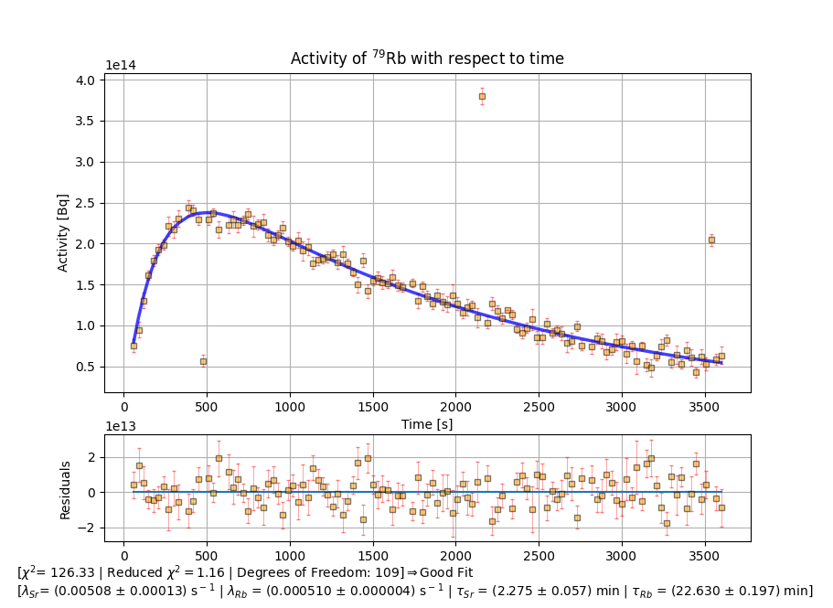
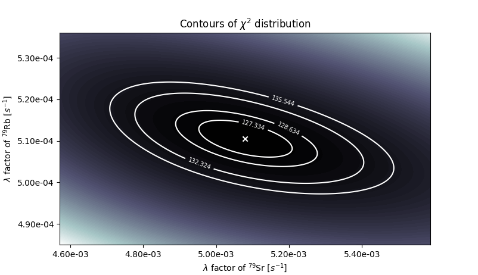

# Data-Analysis-of-a-Nuclear-Physics-Experiment
The script attempts to perform an analysis of activity data collected by two detectors in a nuclear physics experiment. 
The code calculates the lambda coefficients and half-life for Rubidium and Strontium via the minimization of the associated reduced squared function.
The files Nuclear_Data_1.csv and Nuclear_Data_2.csv are sample files for testing. Running the script on them produces:

